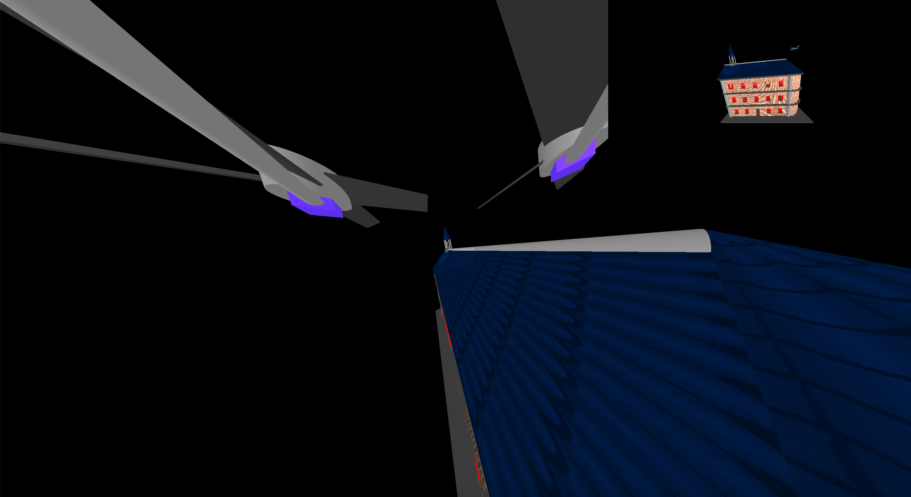

# CS4300 HW6

# USER MANUAL

## Set Config Files to Run the Code

  All the config files are under `src/main/resources/configs`

  For example, just copy `src/main/resources/configs/old_hall_drone.config` to configuration and the code is going to run.

  `old_hall_drone.config` is displaying the drone. The main window is showing the global view and the small top right window is showing the drone camera's view.

  Similarly, other 3 files work as well, including `camera.config`, `tower_global.config`, `tower_drone.config` and `YMCA_global.config`.

### Configuration file

  A template for a valid config file should looks like this:

```
path [path to the xml scene graph file]
mode [GLOBAL/MOVING]
fix-position [x] [y] [z]
fix-center [x] [y] [z]
move-position [x] [y] [z]
move-center [x] [y] [z]
```
  The fix/move-position specifies the position of the camera in global/drone view; and the fix/move-center specifies the point the camera is facing in global/drone view. The up direction of the camera is set to the positive-y direction by default.

## Camera Operations

  There are two different mode to observe in this virtual world. One takes the whole window and another one takes a small corner of the window. You can switch between the two using `Space` key on your keyboard.

  1. Global View

  In the global view, you can observe this virtual world from a constant distance, which is defined by the config file you passed in. In this view you can use your mouse to drag the world like a trackball.

  2. Drone View

  In the drone view, you can view this virtual world through a camera mounted on an unmanned drone flying around. Press `up`, `down`, `left`, `right` to move the drone. Press `w`, `a`, `s`, `d` to turn the direction of the camera. You can also use `f`, `c` to make the camera to slope to the left or right. Press `+`, `-` to zoom in or out, but notice there is a limitation on zooming too far or too near.

  Example:

  First, we start the program using the config file `old_hall_drone.config`:
  

  Pressing `Space` key on your key board will switch the camera to the global view.
  

  In global view, we are able the drag on the screen to change how the world is looked.
  

  Drag back to the original space, drone camera has more functionality.
  

  Press the `s` key to turn camera to look down without moving the drone.
  

  Press the `left` key to move the drone to the left with the camera facing the same direction.
  

  Press the `right` key to move the drone to the right with the camera facing the same direction.
  

  Press the `a` key to turn the camera to look left without moving the drone.
  

  Press the `+` key to zoom in the lens.
  

  Press the `-` key to zoom out the lens.
  

  Press the `down` key to move the drone downwards with the camera facing the same direction.
  

  Press the `f` key to flip the camera to the left without moving the drone.
  

  Press the `c` key to flip the camera back to the right.
  
