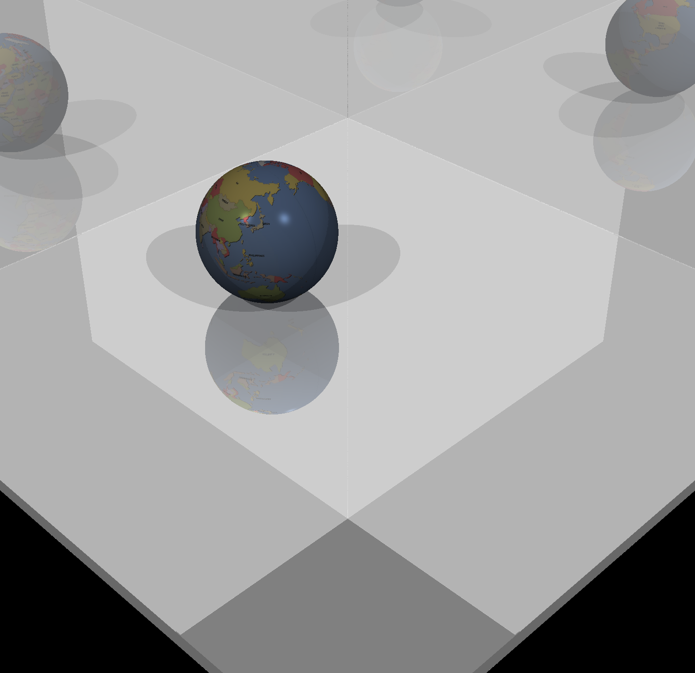
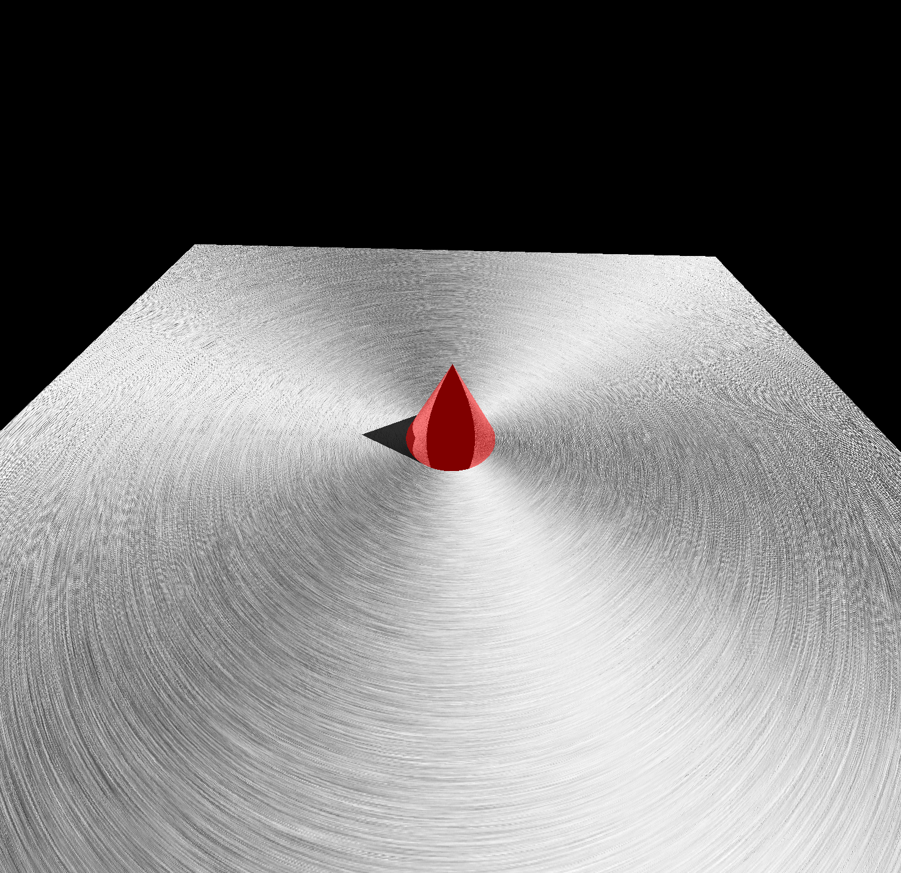
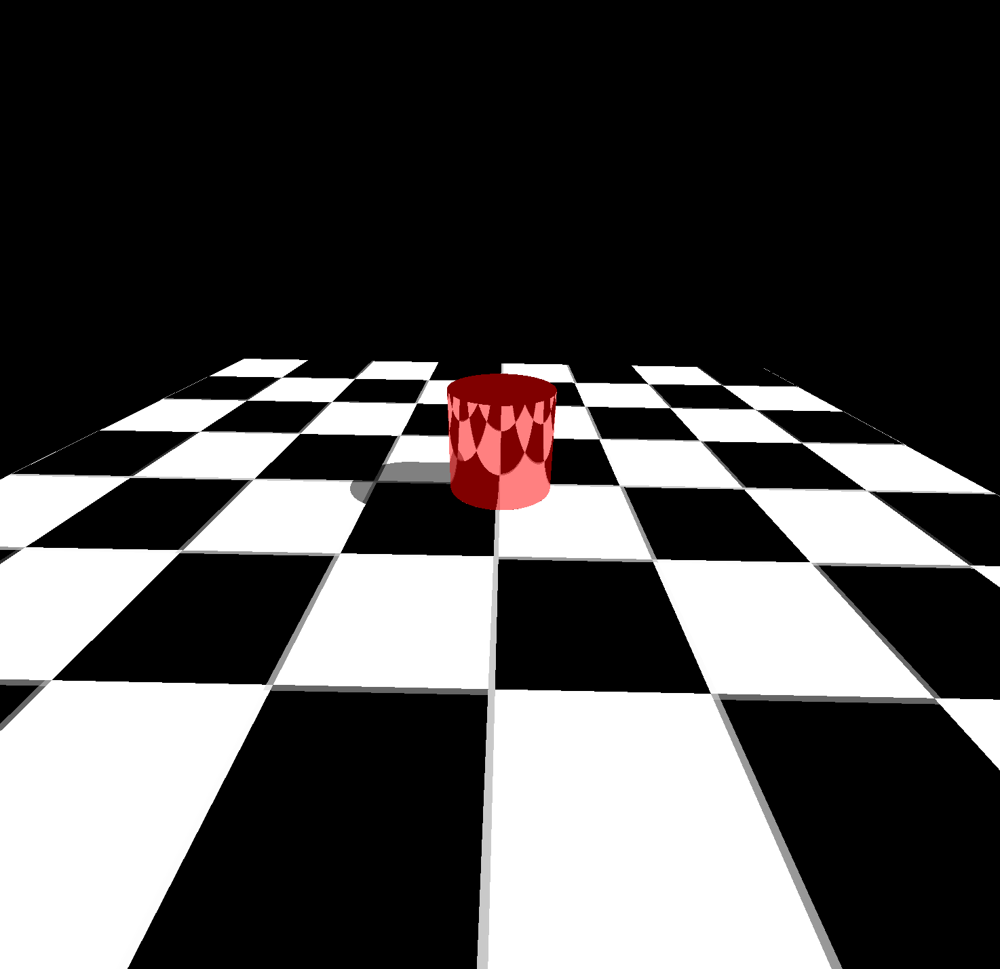
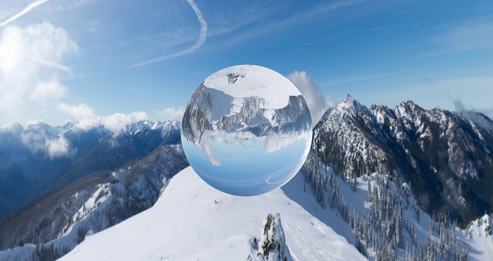
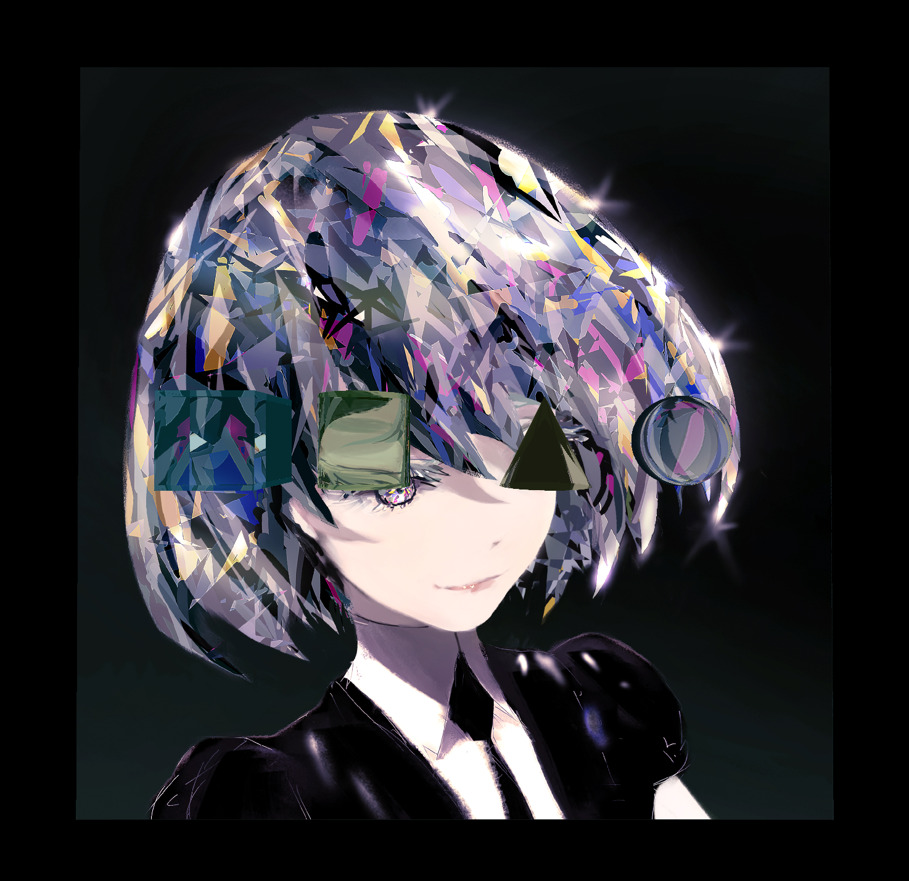
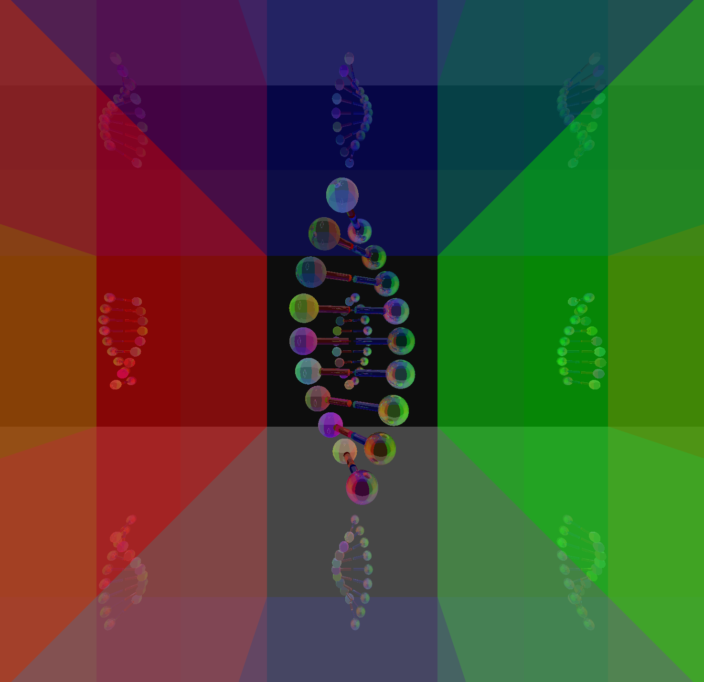

# Assignment 7

## Set Config Files to Run the Code

  All the config files are under `src/main/resources/configs`

  For example, just copy `src/main/resources/configs/camera.config` to configuration and the code is going to run.

  `camera.config` is displaying the final rendering. Camera position: (0,0,150) looking at (0,0,0). The angle of view is set to 70 degrees.

  We are rendering a refraction image there.

We have finished shadowing and reflection.
See this picture render from `shadow.xml` and `shadow.config`

We have finished all the extra credits.

1. Cone: cone.xml

2. Cylinder: cylilnder.xml

3. refraction: snow.xml, refraction.example

4. creative scene: simple.xml

**You may find that when running our code, the texture is inversed. We have asked this problem in Piazza and we were told to fit our image with OpenGL even though OpenGL is rendering the wrong one. We were originally rendering the "correct" image and inverted our rendering after reading the Piazza post.**

Textures coordinates in obj files and corresponding texture images are using upper left corner of image as the origin, while OpenGL is setting the origin at the lower left. In order to have boxes to have texture on all sides, we can just simply flip the image upside down. However, this operation will also be applied spheres and thus cause inverted image. According to the [piazza post](https://piazza.com/class/jqmk9wn2e48c4?cid=196), our ray tracer now simulates OpenGL to have its origin at the lower left corner.

Citation:
snow.jpg http://www.nwicon.com/3608.htm
diamond.jpg painter: wlop https://wlop.artstation.com/
